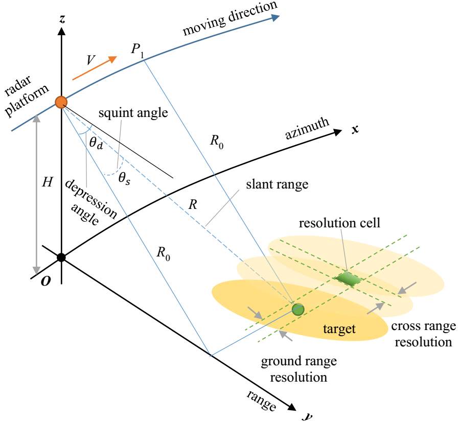
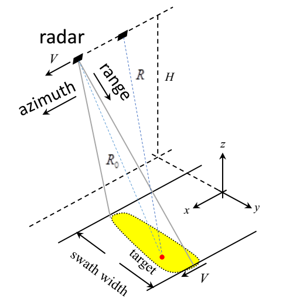
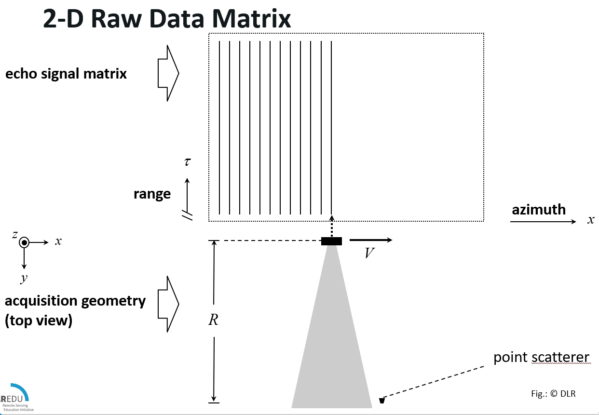
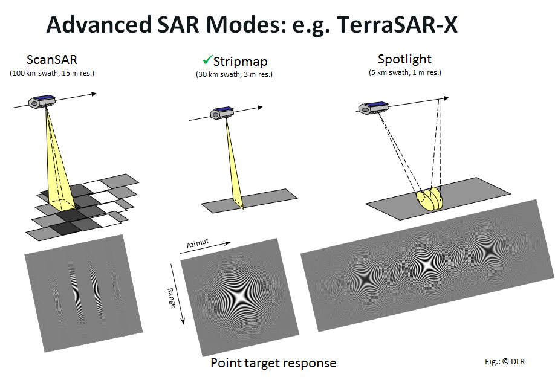

[Synthetic-aperture radar](https://en.wikipedia.org/wiki/Synthetic-aperture_radar)

# SAR成像几何关系

**如果雷达在距离向上不作扫描, 那么雷达成像区域范围与波束宽度有关, 所以超出波束覆盖范围的地方是没法成像的？**

# 符号列表

- $C$ : 光速([Light speed](https://en.wikipedia.org/wiki/Speed_of_light))；
- $f_0$ : 中心频率([Center frequency](https://en.wikipedia.org/wiki/Center_frequency))；
- $f_c$ : 载波频率([Carrier frequency](https://en.wikipedia.org/wiki/Carrier_frequency)), 指载波的中心频率/频率；
- $\lambda = \frac{C}{f_c}$ : 波长([Wavelength](https://en.wikipedia.org/wiki/Wavelength))；
- $D$ 或者 $La$ : 天线真实孔径长度；
- $L_s$ : 合成孔径长度(Synthetic aperture length)；
- $T_s$ : 合成孔径时间(Synthetic aperture time)；
- $R$ : 雷达与目标间的垂直距离/瞬时斜距；
- $\alpha = \lambda / D$ : 天线波束宽度(Antenna beam width)；
- $H$ : 平台高度；
- $V$ : 平台运动速度；
- $T_p$ : 脉冲宽度(pulse width)；
- $K_r$ : 线性调频率(Linear [chirp rate](https://en.wikipedia.org/wiki/Chirp#Rate))；

合成孔径与真实孔径: $L_s = {\lambda \over D} \cdot R$

合成孔径时间与合成孔径长度: $L_s = V T_s$

实孔径距离向分辨率: ${\rho}_r = \frac{C}{2K_rT_p} = \frac{C}{2B}$

实孔径方位向分辨率: ${\rho}_a = {\alpha} \cdot R = \frac{\lambda \cdot R }{D}$

合成孔径方位向分辨率: ${\rho}_a = {\alpha_h} \cdot R= {\frac{\lambda}{2L_s}} \cdot R = \frac{D}{2}$

因为合成孔径雷达发射和接收共用一副天线且信号的距离差是双程差, 进一步锐化了波束, 所以合成孔径雷达的有效半功率波束宽度近似为相同长度实孔径的一半, 它的半功率波束宽度为: $\alpha_h = \frac{\lambda}{2L_s}$

SAR利用脉冲压缩技术获得高的距离向分辨率, 利用合成孔径原理获得高的方位向分辨率, 从而获得高分辨率雷达图像。

SAR回波信号经距离向脉冲压缩后, 雷达的距离分辨率由雷达发射信号带宽决定: $\rho_{r}=\frac{C}{2B_{r}}$ , 式中 $\rho_{r}$ 表示雷达的距离分辨率, $B_{r}$ 表示雷达发射信号带宽, $C$ 表示光速。

同样, SAR回波信号经方位向合成孔径后, 雷达的方位分辨率由雷达方位向的多谱勒带宽决定: $\rho_{a}=\frac{v_{a}}{B_{a}}$ , 式中 $\rho_{a}$ 表示雷达的方位分辨率, $B_{a}$ 表示雷达方位向多谱勒带宽, $v_{a}$ 表示方位向SAR平台速度。在小斜视角的情况下, 方位分辨率近似表示为 $\rho_{a}=\frac{D}{2}$ , 其中 $D$ 是方位向合成孔径的长度。

# 生成回波

## 目标回波分析

由图中几何关系知:  $R(\eta)^2 = R_0^2 + (V\eta)^2$ , 在低斜视角下, $R(\eta)$ 可由菲涅尔近似为:  $R(\eta) = R_0 + \frac{(V\eta)^2}{2R_0}$

接收的回波信号为二维的线性调频信号, 点目标回波表达式为:

$$\begin{array}{l}
{s_r}(\tau ,\eta ) = {A_0}{w_r}(\tau  - 2R(\eta )/C){w_a}(\eta  - {\eta}_c)\\
\exp \left( {2\pi {f_0}(\tau  - 2R(\eta )/C) + \pi {K_r}{{(\tau  - 2R(\eta )/C)}^2}} \right)
\end{array}$$

去除载频后的基带信号为:

$$\begin{array}{l}
{s_r}(\tau ,\eta ) = {A_0}{w_r}(\tau  - 2R(\eta )/C){w_a}(\eta  - {\eta}_c)\\
\exp \left( {-j4\pi {f_0}R(\eta )/C + j\pi {K_r}{{(\tau  - 2R(\eta )/C)}^2}} \right)
\end{array}$$

其中:

- $A_0$ 为复数, 代表点目标的后向散射引起的一个相位和幅度变化, $A_0={A^\prime}_0 \exp \left(j\phi\right)$, ${A^\prime}_0$为后向散射系数, $\phi$为地表散射引起的雷达信号相位的改变
- $\tau$ 为距离向时间
- $\eta$ 为方位向时间, $\eta_c$为零多普勒时间
- $w_a(\cdot)$  为方位向天线增益, $w_r(\cdot)$ 为距离向天线增益
- $f_0$ 为载频

通常取全向天线增益为1, 则回波变为:

$$\begin{array}{l}
{s_r}(\tau ,\eta ) = {A_0} \exp \left( {-j4\pi {f_0}R(\eta )/C + j\pi {K_r}{{(\tau  - 2R(\eta )/C)}^2}} \right)
\end{array}$$

二维场景离散化：

$$
\begin{array}{l}
s({t_{a,{n_a}}},{t_{r,{n_r}}}) = \sum\limits_{i = 1}^H {\sum\limits_{j = 1}^W {g(i,j) \cdot p\left( {{t_{r,{n_r}}} - 2R({t_{a,{n_a}}},i,j)/c} \right)} }\exp \left( { - j4\pi {f_c}R({t_{a,{n_a}}},i,j)/c} \right),
\end{array}
\label{equ:DiscreteRecieveSignal}
$$

## 目标回波基础理论

SAR的回波数据可以看作是地面反射率$\gamma(\tau, \eta)$与雷达系统冲激响应$h(\tau, \eta)$进行二维卷积, 即:

$$S(\tau, \eta)=\gamma(\tau, \eta) \otimes h(\tau, \eta) + n(\tau, \eta)$$

其中, $n(\tau, \eta)$ 为系统噪声。因此不管是点目标还是面目标都可以通过SAR的接收信号的一般模型求得回 波表达式, SAR 的成像处理过程, 其实际上也是一个通过解卷积从回波信号中最 大程度地、无失真地提取地表的后向散射系数的二维分布

## 时域回波仿真

在得到点目标回波信号后, 传统的时域回波模拟方法也叫距离时域脉冲相干 算法是将一个目标场景图像细化成一个点阵, 直接模拟雷达的工作过程,在雷达平台方位向的每一个位置,先计算出天线波束照射范围内即距离向每个点目标的回波信号,然后将这些信号叠加得到最终的回波信号。

### 点目标

单个点目标回波的表达式即为上述点目标回波表达式, 多个点目标可以看成每个点目标回波的叠加:

$$s(\tau, \eta) = \sum_{i=1}^{n}{s_i(\tau,\eta)}$$

其中, $n$为点目标的个数, $s_i(\tau,\eta)$为点目标回波。

### 面目标

对于面目标就是把目标场景分割成一个均匀分布的点阵。这个是相对精确地面目标时域回波仿真方法, 但是在面目标相对较大时, 那么它被分割成的点 阵数量就多, 相应的数据量就大, 计算量也高。

# 回波存储

# SAR成像模式

# 术语

- `foot print`: 雷达波束在地面上的脚印, 即指真实孔径照射的区域

